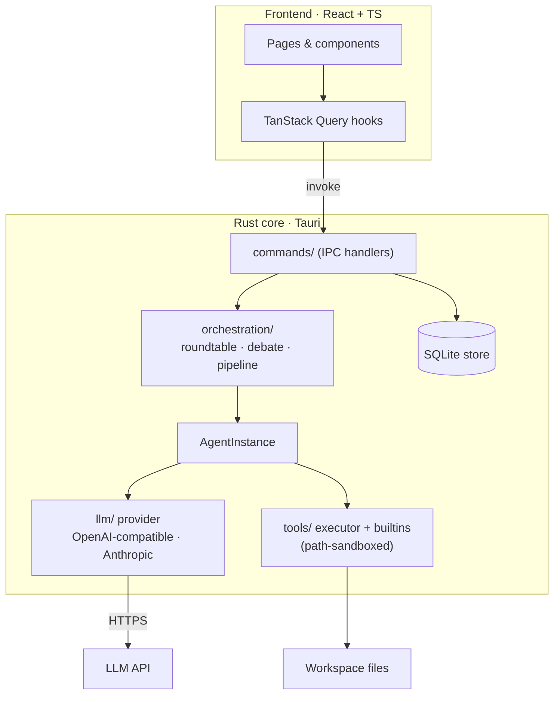
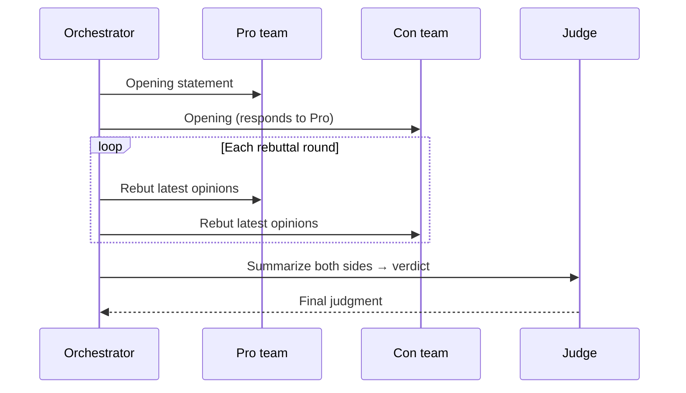

# Agent Team

[](https://github.com/MScanter/agent-team/actions/workflows/ci.yml)
[](https://github.com/MScanter/agent-team/actions/workflows/release.yml)
[](LICENSE)


A desktop app for orchestrating multi-agent AI discussions. Create agents, build teams, run real-time collaborative conversations.

## What is this?

Agent Team lets you define AI agents with custom prompts and personalities, assemble them into teams, and start multi-round discussions where they collaborate in real time. Agents can also read/write files in a workspace directory during discussions via built-in tools.

Everything runs locally. Data lives in SQLite. Bring your own OpenAI-compatible API key.

## Screenshots

<!--
  Drop captured images into docs/screenshots/ (see docs/screenshots/README.md for
  the recommended shots and sizes), then uncomment the block below.

  <p align="center">
    
  </p>

  | Home | Agents | Debate in progress |
  |------|--------|--------------------|
  |  |  |  |
-->

> 📸 Screenshots & a short demo GIF live in [`docs/screenshots/`](docs/screenshots/).

## Collaboration Modes

| Mode | How it works |
|------|-------------|
| **Roundtable** | Agents take turns sharing opinions, then summarize together |
| **Pipeline** | Sequential — each agent's output feeds the next |
| **Debate** | Auto-splits into pro/con teams with a judge |
| **Freeform** | Open discussion, no fixed turn order |

## Architecture

The frontend talks to the Rust core exclusively through Tauri's typed IPC
("invoke") commands. The core owns orchestration, the LLM abstraction, the
sandboxed tool layer, and SQLite persistence.



The **Debate** engine is the most structured mode — it auto-assigns a judge,
splits the rest into pro/con, runs opening statements and rebuttal rounds, then
asks the judge for a verdict:



## Tech Stack

Tauri 2 (Rust) · React 18 · TypeScript · Tailwind CSS · SQLite · Zustand · TanStack Query

## Quick Start

```bash
# Install dependencies
npm --prefix frontend install
npm --prefix backend install

# Run in dev mode
npm --prefix backend run tauri:dev
```

Requires Rust toolchain and Node.js >= 18. See the
[Tauri prerequisites](https://v2.tauri.app/start/prerequisites/) for platform
setup, and [CONTRIBUTING.md](CONTRIBUTING.md) for the full developer workflow.

## Build

```bash
npm --prefix backend run tauri:build
```

Output in `backend/target/release/bundle/`. Tagged pushes (`v*`) build installers
for macOS, Linux, and Windows automatically via the release workflow.

## Project Structure

```
backend/src/
  commands/        Tauri invoke handlers
  orchestration/   Collaboration engines (roundtable/debate/pipeline)
  tools/           Built-in file & code tools + executor + path security
  store/           SQLite persistence
  llm/             LLM provider abstraction (OpenAI-compatible + Anthropic)
  models/          Domain types (agent / team / execution)

frontend/src/
  pages/           Home, Agents, Teams, Execution
  components/      UI components (Agent, Team, Execution, ModelConfig, Common)
  hooks/           React Query hooks
  services/        API layer + Tauri bridge
  stores/          Zustand state
```

## Environment Variables

| Variable | Purpose |
|----------|---------|
| `STORE_SQLITE_PATH` | Custom SQLite database path |
| `VITE_BACKEND_TARGET` | Backend proxy for frontend-only dev (default `http://localhost:8080`) |

LLM API keys are entered in the app's Model settings and stored locally — they
are never read from the environment or committed to the repo.

## Testing

```bash
cargo test --all-targets          # backend unit tests (run inside backend/)
npm run lint && npm run build      # frontend lint + type-check (inside frontend/)
```

## License

[MIT](LICENSE) © Miles
